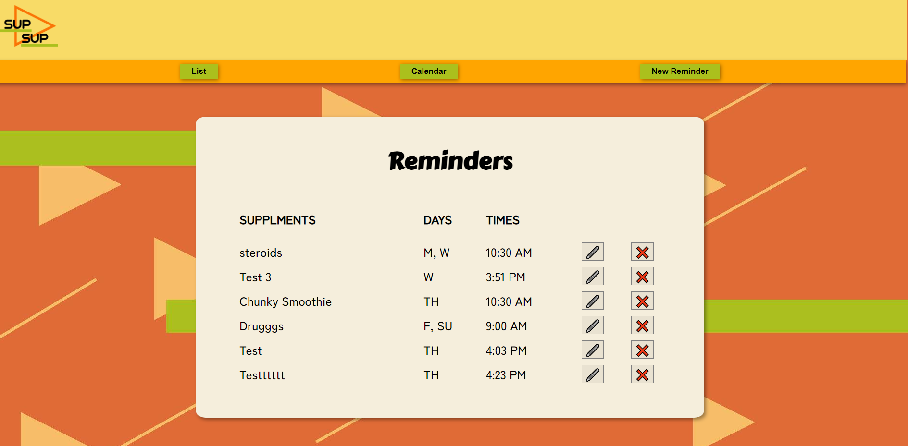

# Sup Sup

## Description
Sup Sup is a **supplement tracking application** created by Aruna Evan and Justin Chittarath. In the past, we both had issues remembering when to take our supplements throughout our busy days. This seems to be a common occurance among the people we are surrounded by. This app is meant to solve this ubiquitous issue. It has features that allow you to submit a reminder and choose what days and time to receive a notification. A sound plays concurrent with the notification. You can edit and delete reminders. There is a calendar page that shows what days have active supplement reminders. You can click on a date and it will display the corresponding list of supplements. All data is stored on a local server. Here's to better health ! :)

## Installation
To utilize our application, the following steps must be completed in order:
1. Fork the code into your own repository.
2. Clone the file onto your local machine.
3. Open the code in your VS code.
4. Run ```npm install``` to install required dependencies.
5. Run ```json-server --watch --port 4000 db.json``` to fire up the local server.
6. Run ```npm start``` to open the app in your default browser.

## Notable Dependencies
- "json-server": "^0.17.0",
- "react": "^17.0.2",
- "react-calendar": "^3.5.0",
- "react-router-dom": "^5.3.0",
- "react-time-picker": "^4.4.3",
- "router": "^1.3.5",
- "styled-components": "^5.3.3"

# How To Use
To add a reminder, click **New Reminder** in the nav bar.
<br>

<br>
Fill out the form and click submit. You should automatically be redirected back to the **Reminder List** page, here you can view, edit, and delete reminders.
<br>

<br>
You can also select **Calendar** in the navigation bar. Here you can click on a day on the calendar to view what is in store for the day, and also delete and edit the reminders.
<br>

<br>
When the date and time you submitted is the same as your local time, a notification will appear and sound.

## Roadmap
Some functionality we wish to implement in the future:

- Host the application and database on servers.
    - options include: heroku, supabase, and github.

- Create user login functionality.
    - note: supabase makes auth easy

- Allow users to create text/phone reminders.
    - technologies: twilio, cron jobs, and cron job scheduler
    - allow users to enter their own API keys on signup

The benefits of hosting on a local machine include information privacy (supplements, phone number, API keys, etc). Hosting on an external server would allow for text updates and eliminate the need for continuous use of the app in order to receive notifications.

## Contributing
Anyone can contribute, there are no requirements.

## License

Copyright (c) [2021] [Justin Chittarath] [Aruna Evan]

## Authors
Justin Chittarath & Aruna Evan